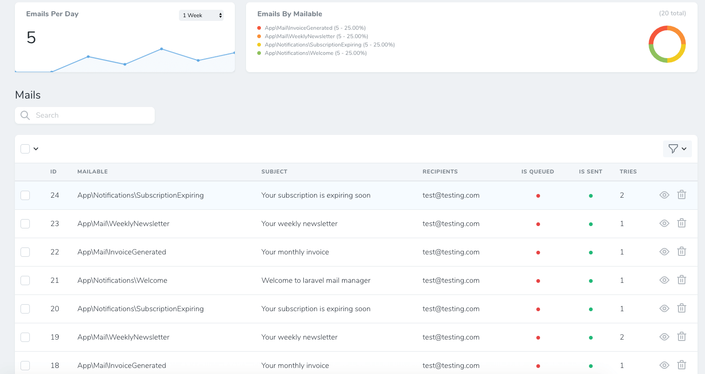

## Nova Mail Manager

A [Laravel Nova](https://nova.laravel.com/) tool to easily resend your system generated emails without going through entire application flow.

> Internally this package uses [Laravel Mail Manager](https://github.com/binarybuilds/laravel-mail-manager) to record and resend emails.



### Nova 4

All credits go to [binarybuilds](https://github.com/binarybuilds/nova-mail-manager) for creating this package.
We changed the package so it works with Nova 4.

### Installation

This package can be installed using composer.

```bash
composer require binarybuilds/nova-mail-manager
```

Next you must register the package's service provider by adding the below line to `providers` array inside
`config/app.php` file.

```php
    'providers' => [
        //
        \BinaryBuilds\NovaMailManager\NovaMailManagerServiceProvider::class
    ]
```

#### Conflicts With Laravel Telescope

The dependent package([Laravel Mail Manager](https://github.com/binarybuilds/laravel-mail-manager)) currently conflicts
with laravel telescope. If you are using laravel telescope in your application,
Make sure you register the nova mail manager package's service provider after the telescope service provider is registered.

If you are registering telescope using `config/app.php` file, Then add the service provider after the telescope service
provider as shown below.

```php
    'providers' => [
        //
        App\Providers\TelescopeServiceProvider::class,
        \BinaryBuilds\NovaMailManager\NovaMailManagerServiceProvider::class
    ]
```

If you are registering telescope manually using `AppServiceProvider.php` file or any other service provider, Then register this package service
provider after the telescope service provider is registered as shown below.

```php
$this->app->register(TelescopeServiceProvider::class);
$this->app->register(NovaMailManagerServiceProvider::class);
```

Next, Publish the package configuration file by running

```bash
php artisan vendor:publish --tag=laravel-mail-manager-config
```

Run migrations to create the table required to store the emails.

```
php artisan migrate
```

This will create a table `mail_manager_mails`. You can configure the table name using the published configuration file
located in `config/mail_manager.php`

Next, Inside your `App/Providers/NovaServiceProvider.php` file, register the tool inside the `tools` method as shown below.

```php
public function tools()
{
    return [
        //
        new \BinaryBuilds\NovaMailManager\NovaMailManager()
    ];
}
```

### Usage

After installation, You will see `Mail Manager` in the nova navigation menu. Clicking on the link will take you to the
tool page where you can view and resend mails.

> The dependent package([Laravel Mail Manager](https://github.com/binarybuilds/laravel-mail-manager)) has few commands
> which you can use to manage mails. Checkout the readme file of [Laravel Mail Manager](https://github.com/binarybuilds/laravel-mail-manager)
> package for details.

## Contributing

Thank you for considering contributing to Nova mail manager! Please create a pull request with your contributions with
detailed explanation of the changes you are proposing.

## License

This package is open-sourced software licensed under the [MIT license](LICENSE.md).
